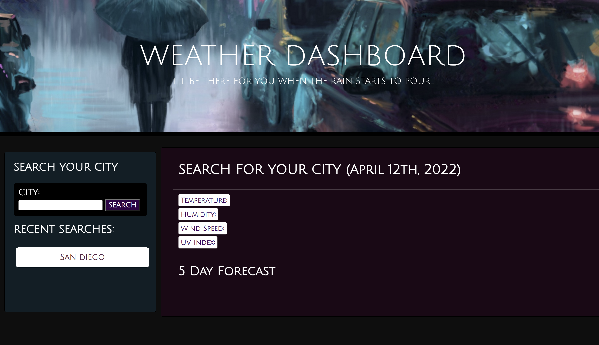
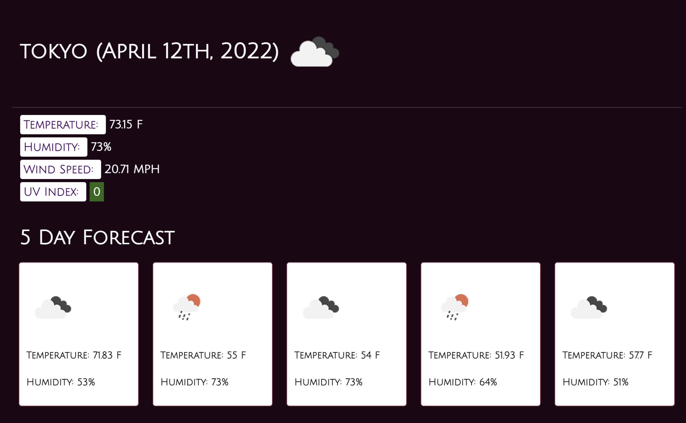
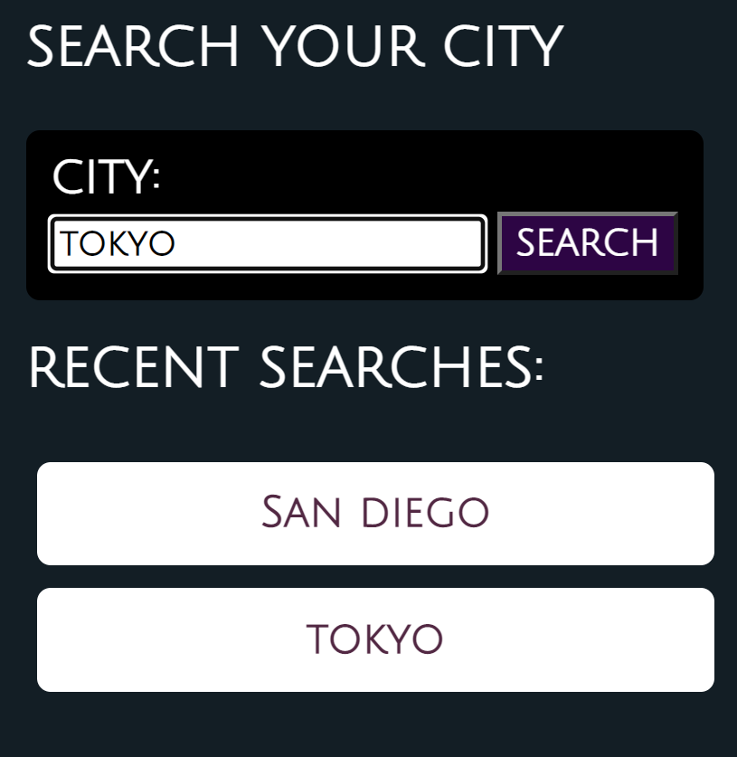
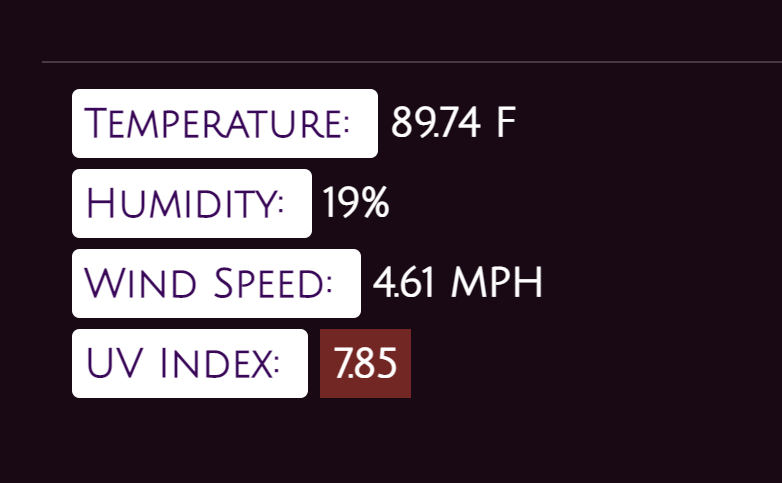

# Weather Dashboard

The Weather dashboard is an app designed to get you weather data for over 200,000 cities in the world. It not only gives you the current weather update for the desired city but it also gives you the forecast for the next 5 days.

The Openweathermap API was used to fetch weather data for all the cities and moment.js was used for sdisplaying the current and future dates on the application. 

 

# Deployed link

You can try out the dashboard by visiting the link below:   
<a href= "https://github.com/MoeCancode/weather-dashboard">Weather Dashboard</a>

 

# Technologies used

- [HTML](https://developer.mozilla.org/en-US/docs/Web/HTML)
- [CSS](https://developer.mozilla.org/en-US/docs/Web/CSS)
- [Bootstrap](https://getbootstrap.com/)
- [Javascript](https://developer.mozilla.org/en-US/docs/Web/JavaScript)
- [jQuery](https://api.jquery.com/)
- [Openweathermap API](https://openweathermap.org/api)
- [Git/Github](https://github.com/)
- [Chrome Developer Tools](https://developer.chrome.com/docs/devtools/)

 

# Layout

The webpage has a simple layout with a dark yet colorful theme to look appealing. On the left side you can find a search bar and on the right side you can find a container that displays data for the city searched.

 

 

# Working

A user can input a city name in the search bar and get the current weather conditions for that city. Additionally, the "5 Day Forecast" section will generate 5 cards that show the temperature and humidity for the next 5 days. 

 

 

Searched cities are also stored in local storage and a button for those cities is added to the recent searches section. The user can then click on those buttons to act as a shortcut.

 

 

The UV index is color-coded to indicate how harsh the conditions are. A green background is favorable, a yellow background is moderate, while a red background is severe.

 

 

# Future Work

A feature will be added to make the 5 Day Forecast cards clickable. When clicked, the user will be given more details about the weather on that particular day.

 

# Contributors

**Mohammad Abuzar Razvi**

 

# License

MIT License

Copyright (c) [2022] [Mohammad Abuzar Razvi]

Permission is hereby granted, free of charge, to any person obtaining a copy
of this software and associated documentation files (the "Software"), to deal
in the Software without restriction, including without limitation the rights
to use, copy, modify, merge, publish, distribute, sublicense, and/or sell
copies of the Software, and to permit persons to whom the Software is
furnished to do so, subject to the following conditions:

The above copyright notice and this permission notice shall be included in all
copies or substantial portions of the Software.

THE SOFTWARE IS PROVIDED "AS IS", WITHOUT WARRANTY OF ANY KIND, EXPRESS OR
IMPLIED, INCLUDING BUT NOT LIMITED TO THE WARRANTIES OF MERCHANTABILITY,
FITNESS FOR A PARTICULAR PURPOSE AND NONINFRINGEMENT. IN NO EVENT SHALL THE
AUTHORS OR COPYRIGHT HOLDERS BE LIABLE FOR ANY CLAIM, DAMAGES OR OTHER
LIABILITY, WHETHER IN AN ACTION OF CONTRACT, TORT OR OTHERWISE, ARISING FROM,
OUT OF OR IN CONNECTION WITH THE SOFTWARE OR THE USE OR OTHER DEALINGS IN THE
SOFTWARE.